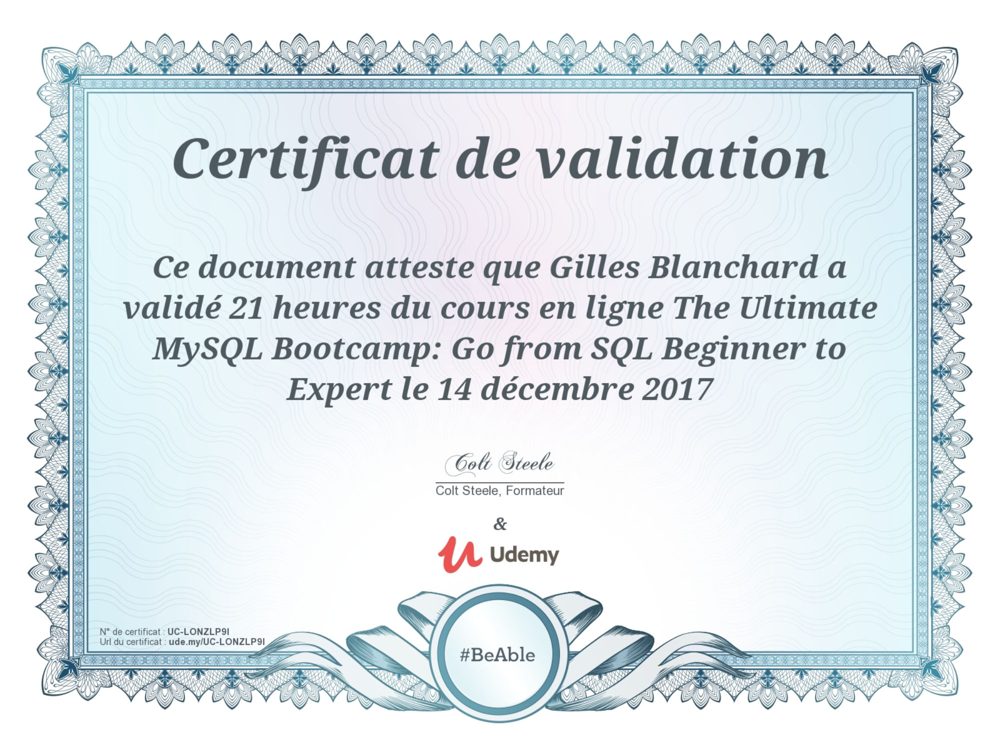
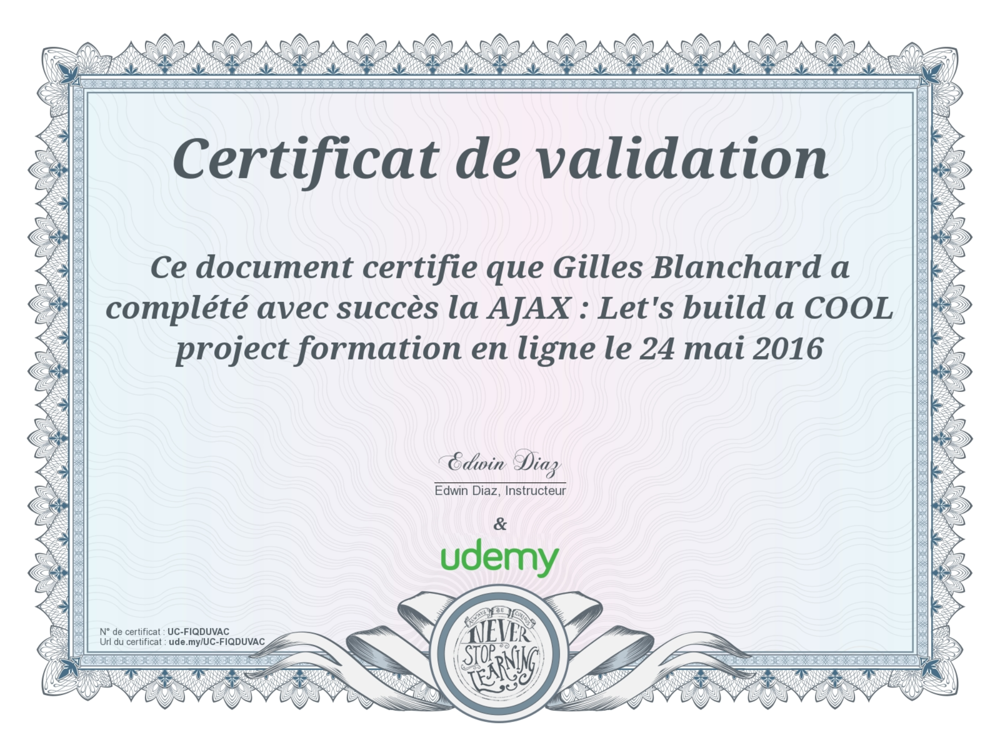
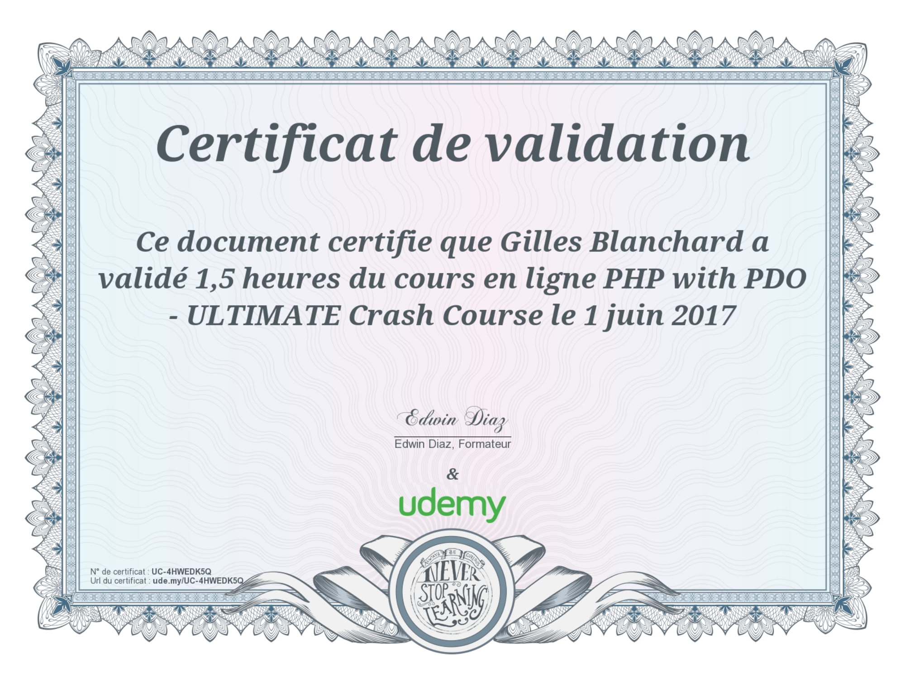
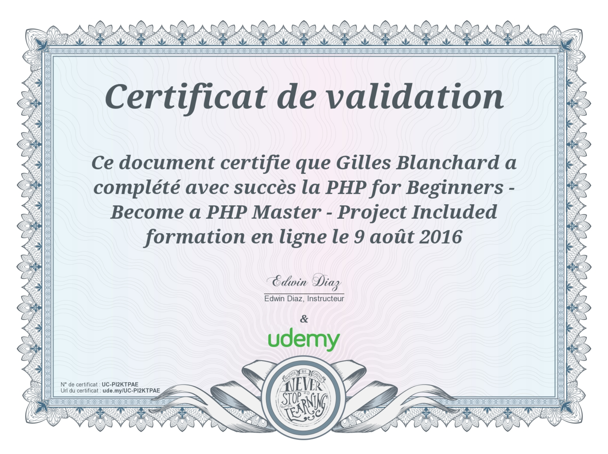
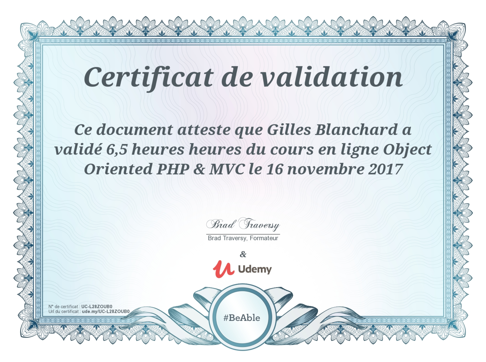
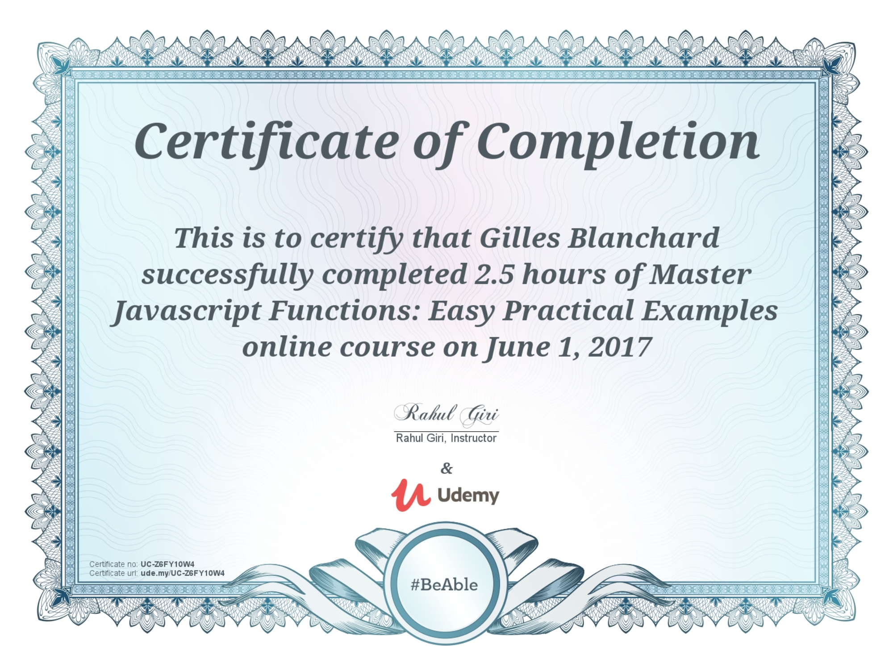
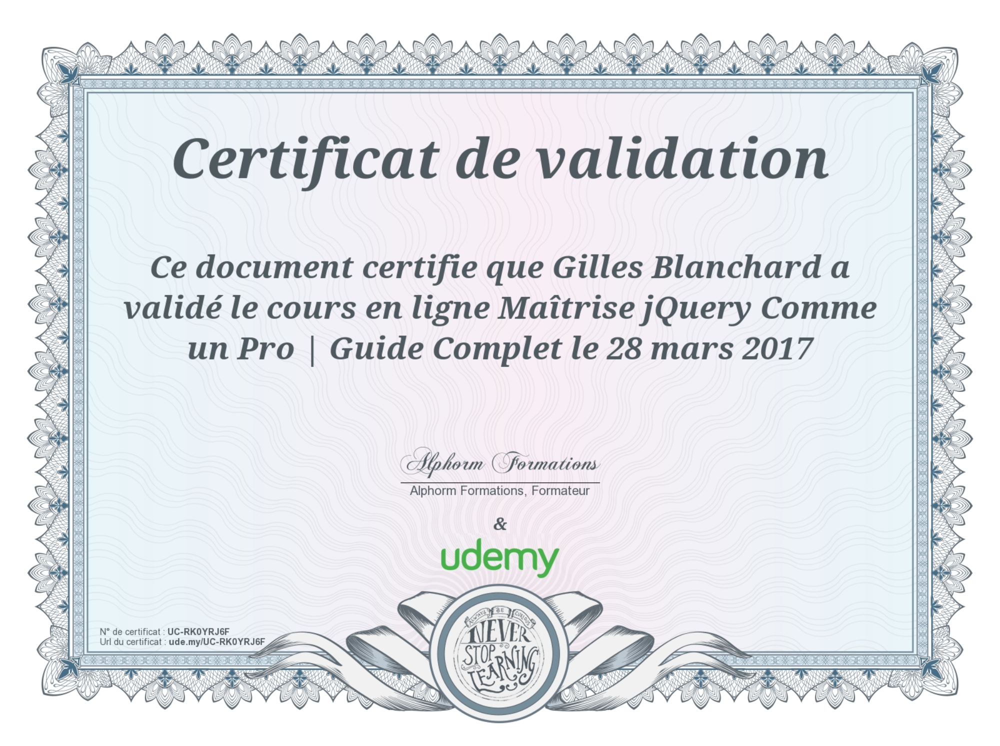
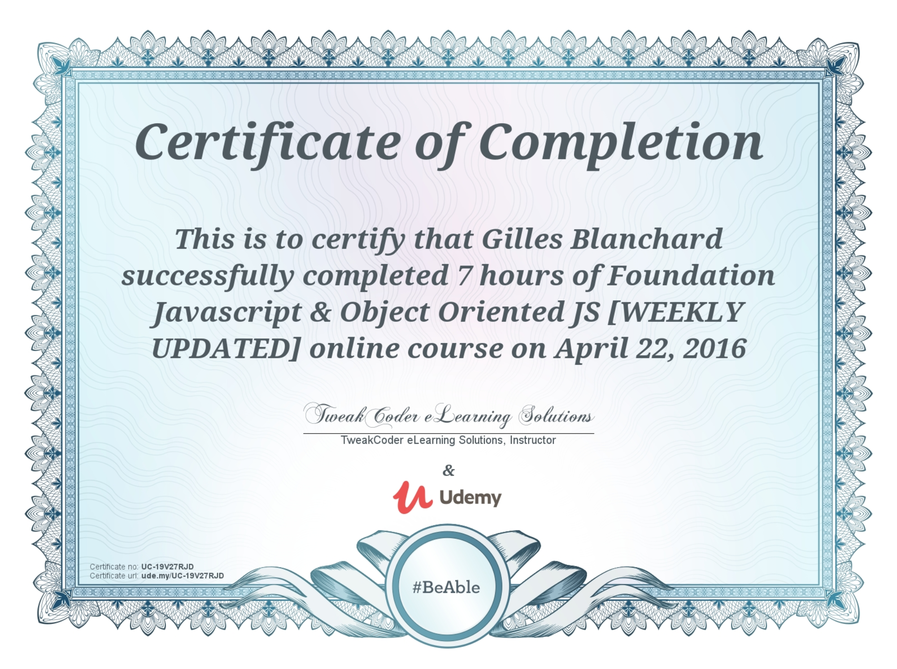

> **Not exhaustive list**

> [Visit my Portofolio here](https://projets.neworldwebsites.fr/)

# Cerfifications

  
  

  
  

  
  

  
  

.png)

## Motivation
* Les certificats proviennent des meilleurs mentors du web pour atteindre le niveau nécessaire à pouvoir contribuer.

* The certificates come from the best mentors of the web to reach the level needed to contribute.

## Passion
* Me pousse toujours à vouloir comprendre plus en profondeur chaque fondamentaux des languages du dévelopement web.

* Always pushes me to want to understand more in depth each fundamental of the languages of the web development.

## Organisation
* Une progression lente sans aucune précipitation, pour obtenir une fondation solide et robuste.

* A slow progression without any precipitation, to obtain a solid and robust foundation.

